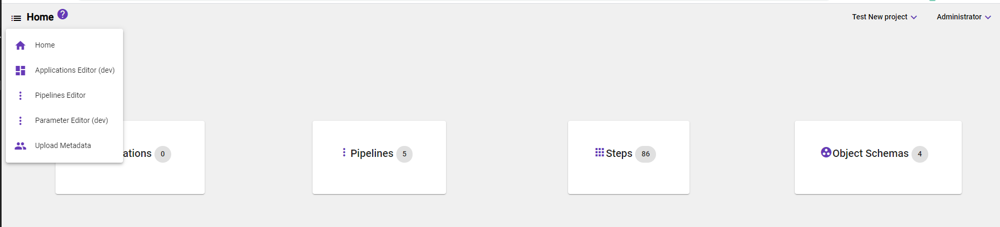
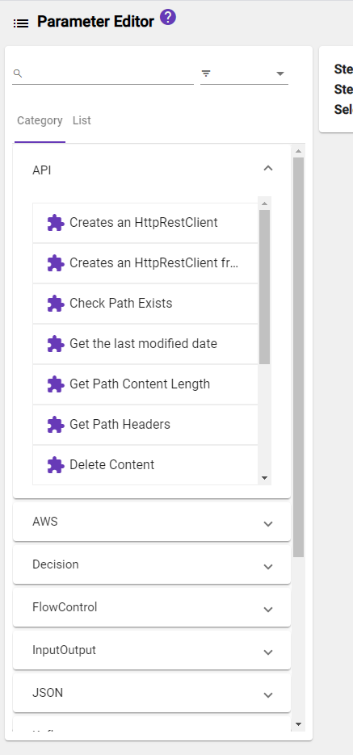
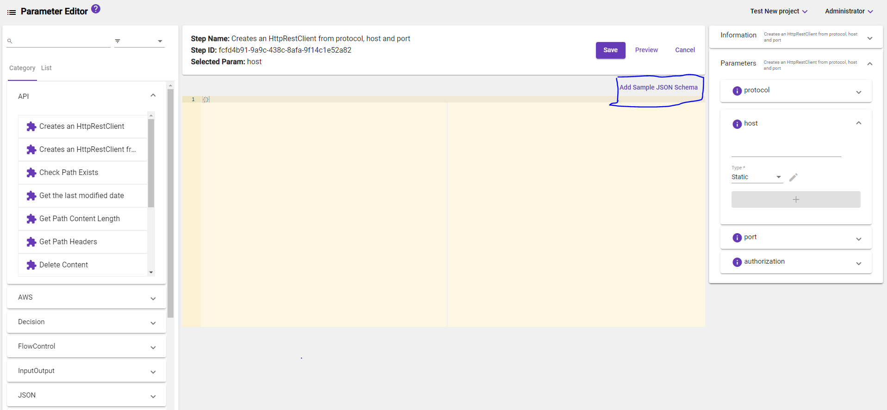
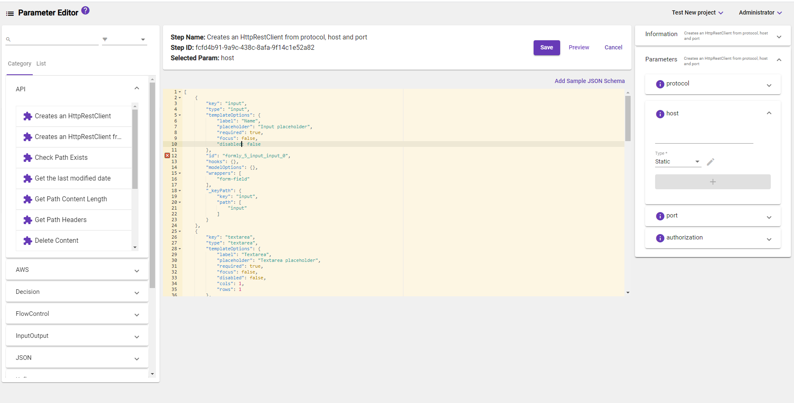
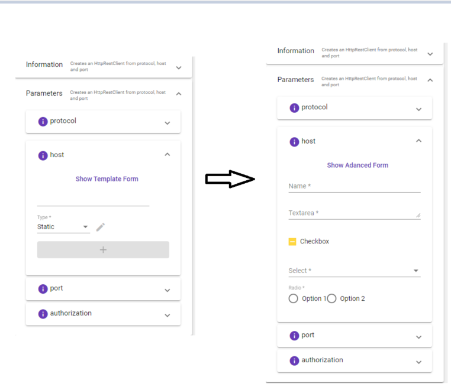
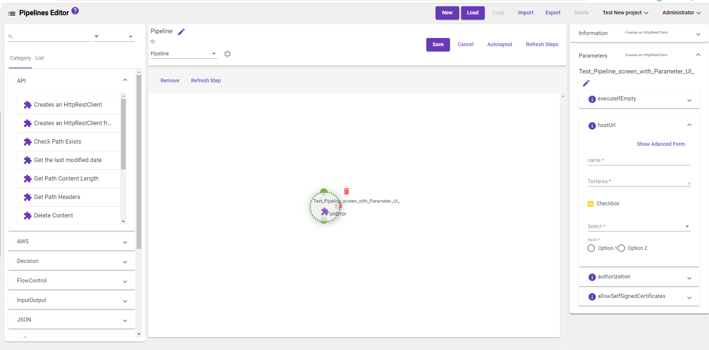

[Home](readme.md)
# Parameter-Editor 
The Parameter-Editor is a specialized component which gives admins ability to configure formly JSON structure to render custom UI for a step parameter. Prior to this feature, a user would need to choose the step parameter from different options based on its value purpose.

Steps to follow in parameter editor

1) Go to menu panel in home page and click on Parameter Editor UI button. 

2) Select any step from left side category list. 

3) On the right side step parameters will be loaded and expand the parameter which will bring down JSON editor.

Note: On adding new JSON we have to follow exact JSON formly format(https://formly.dev/examples/advanced/json-schema).

4) In JSON editor screen we have Add Sample Json Scheme UI button on top right side, once we click on this button it will add sample formly json to the editor screen. 

5) After added JSON editor screen will show the JSON and we can edit if want.(There is vaidation as well if we add wrong syntax json,it shows X red mark)

6) After JSON edit done click preview button.

 

7) Once we click on Preview button new UI will reflect based on given formly json in right side parameter expansion panel.

 

8) We have Show Advnced form/Show Templte form toggle button which will bring old template if we want.
  
   

9) Each parameter has its own new UI.

# Pipeline-Editor

Once new formly JSON is configured for the step parameter the same UI will be rendered in the pipeline editor when user select a step and expand the parameter and the value changes will reflect in the peipeline parameter value.

In Pepeline editor screen also on each parameter we have same feature with show Advanced/Templte form toggle button to bring back old teplate UI.
