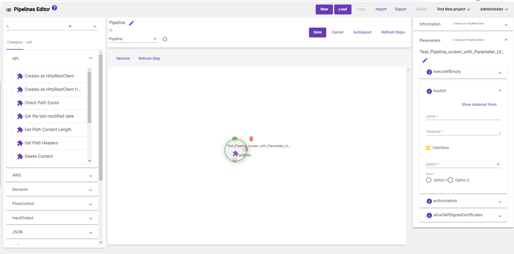

[Home](readme.md)
# Parameter-Editor 
The Parameter-Editor is a specialized component which gives admins ability to configure formly JSON structure to render custom UI for a step parameter. Prior to this feature, a user would need to choose the step parameter from different options based on its value purpose.

Steps to follow in parameter editor
  1) Go to Navigation Menu panel in home page and click on Parameter Editor UI button. 
  2) Select any step from left side category list and add the formly JSON.
  3) After JSON added click preview button  
  
Note: On adding new JSON we have to follow exact JSON formly format(https://formly.dev/examples/advanced/json-schema).

 
 

Once we added JSON click on Preview button to reflect UI render in right side parameter expansion panel.

 

Each parameter has its own new UI and we do have show Template/Advanced toggle button. With these two action button we have chance to bring back old UI.

 

Once new formly JSON is configured for the step parameter the same UI will be rendered in the pipeline editor when user select a step and expand the parameter and the value changes will reflect in the peipeline parameter value.

.
