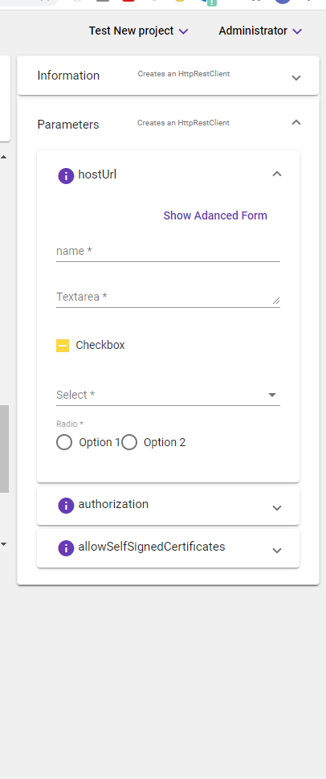

[Home](readme.md)
# Parameter-Editor 
The Parameter-Editor is a specialized component which gives user ability to import formly JSON structure to render custom UI. Prior to this feature,
a developer would  need to follow the exact formly JSON to correctly render the UI.

Steps to follow in parameter editor
  1: Go to menu panel in home page and click on Parameter Editor UI button. 
  2: Select any step from left side category list and add the formly JSON.
  3: After JSON added click preview button  
  Note: On adding new JSON we have to follow exact JSON formly format(https://formly.dev/examples/advanced/json-schema).
 
 

Once we added JSON click on Preview button to reflect UI render in right side parameter expansion panel.

 

Each parameter has its own new UI and we do have show Template/Advanced toggle button. With these two action button we do have chance to bring back old UI.

 Once we done with adding and checking new formly JSON UI in Parameter screen go to Pepelines-editor UI and click step on what we have added formly JSON in parameter UI. 
.
We can add all inputs in this UI and save to our own Pipeline.
