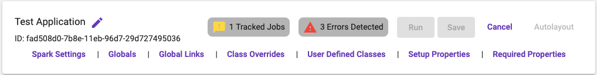

[Home](readme.md)

# Control Panel
The control panel provides access to the specific properties of the application including the name.

Real time errors will be displayed here. Clicking the error display will open a modal providing specific issues.

Action buttons for working with the application include:

* Save: Saves the application
* Cancel: Cancels any unsaved changes
* Auto Layout: Organizes the steps on the designer
  
An additional row of links are available for editing the application level properties.

* Spark Settings: Allows setting SparkConf properties and registering Kryo classes.
* Globals: Allows adding properties to the application level globals.
* Global Links: Provides a simple editor for registering global links. This editor should be used after all executions have been created.
* Class Overrides: Editor that allows overriding the default classes such as [PipelineManager](https://acxiom.github.io/metalus/docs/pipeline-manager.html) and PipelineListener.
* User Defined Classes:Allows registering UDFs and JSON4S Serializers.
* Setup Properties: These properties provide a location to place data that may need to be used when setting up the
  execution plan. These properties will not be available during execution. The default ApplicationDriverSetup does not use these
  properties.

