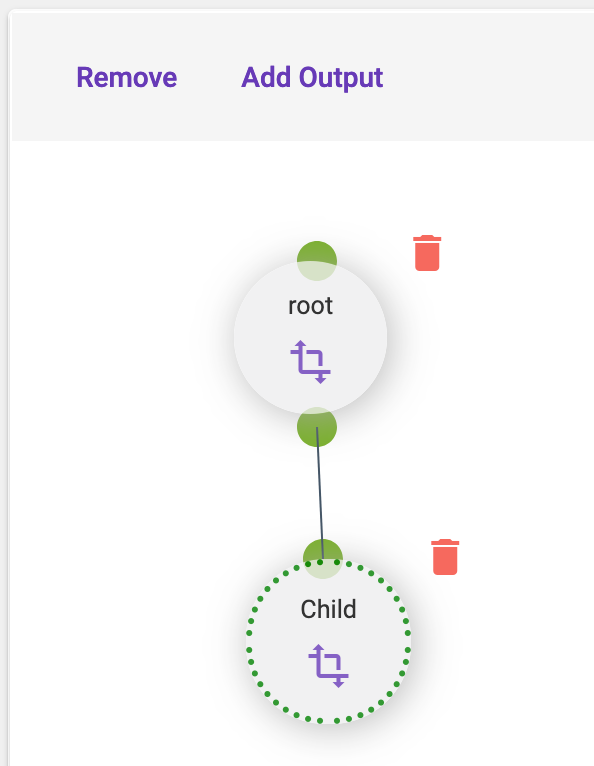

[Home](readme.md)

# Application Designer
The designer allows organizing and linking executions.

# Execution
When an [execution template](application-editor-execution-templates.md) is dragged to the designer, it will have
a single input and no outputs. Executions **do not** have to have a child or a parent. When the execution is selected,
the designer toolbar will appear with two actions: Remove and Add Output.

## Add Output
Allows an output to be added to the selected execution and then one or more child executions may be linked.
This linking will define the dependencies used during plan execution. 
