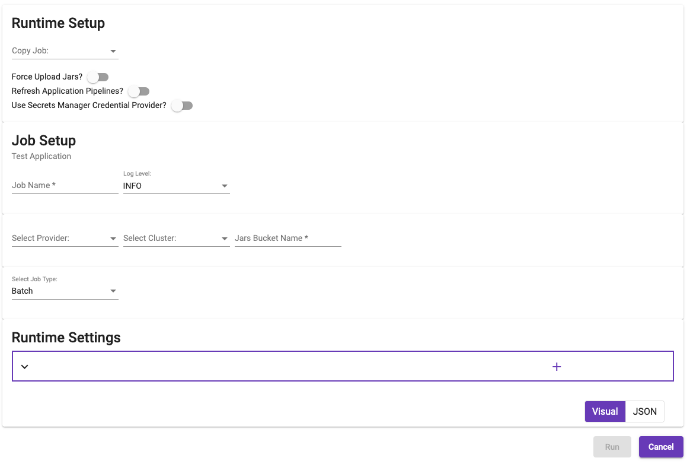
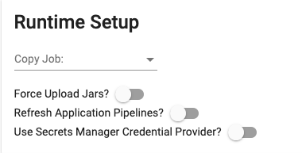
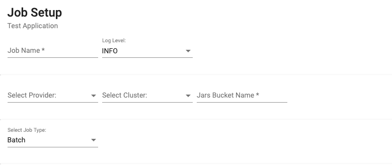
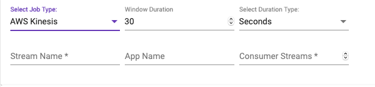
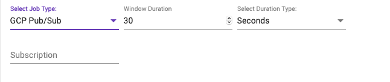

[Home](readme.md)

# Run Application
The Application Editor allows the selected application to be executed against a predefined provider/cluster. Developers
can now test changes by uploading jars using the [Upload](upload.md) screen. Special handling has been added to always
use the uploaded jars for the selected project before pulling from Maven Central. Jobs will use the _Metalus Application_
as the main jar and copy the required jars (determined by the _Metalus Utils Dependency Manager_) to a bucket on the Cloud
provider being used. The required jars will be determined by scanning the pipeline steps to create a unique list from the
tags element. All referenced pipelines will be pulled from the saved application unless the _Refresh Application Pipelines?_
option is selected which will cause pipelines to be pulled using the API and stored in the application JSON prior to submitting
the job.

## Runtime Setup
The _Runtime Setup_ section presents several questions which change the way the application will be executed.

### Copy Job
A selection of previous jobs related to this application are available to fill in most of the form fields. Selecting a tracked
job will fill in several fields on the form. The _Runtime Settings_ will not be filled in.
### Force Upload Jars
This option determines whether the dependent jars will be uploaded regardless of the presence on the remote bucket.
### Refresh Application Pipelines
This option will pull the referenced pipelines from the API to ensure latest changes are used without having to save the
application again.
### Use Secrets Manager Credential Provider
This option will inject the appropriate Secrets Manager based _CredentialProvider_ into the application metadata prior to
execution. Note: The account executing the job will need to have permissions to retrieve values from the Secrets Manager.
## Job Setup
The _Job Setup_ section contains information about the tracked job required to execute.

### Job Name
The job name will be displayed in the _Copy Job_ selection as well as the status page.
### Log Level
Sets the overall log level for the application. This does not affect the Spark logs.
### Select Provider
Select which provider will be used to execute the application.
### Select Cluster
Select which cluster to use during execution.
### Job Type
Select whether this is a batch job, a streaming job pointed at Kinesis or a streaming job pointed at a Pub/Sub subscription.
#### Batch
Batch jobs are run and will eventually complete. No other settings are required.
#### Streaming Jobs
There are currently two support streaming jobs. The _Window Duration_ defines how long Spark will wait before creating an RDD that
can be processed. The _Duration Type_ defines the time unit of the _Window Duration_.
##### AWS Kinesis
A streaming job which takes input from a Kinesis stream. Additional settings are required:

###### Stream Name
The stream name that should be used when setting up the consumer.
###### App Name
An optional name to use when logging messages.
###### Consumer Streams
The number of consumer threads to use while receiving data from Kinesis. The default is the number of shards that are defined.
##### GCP Pub/Sub
A streaming job which takes input from a Pub/Sub stream. Additional settings are required:

###### Subscription
The subscription to use when consuming data.
## Runtime Settings
Before an application can be executed, it is scanned for any global or runtime parameters that are not defined as part
of the application. The values will be presented to the user so that values may be provided. 
