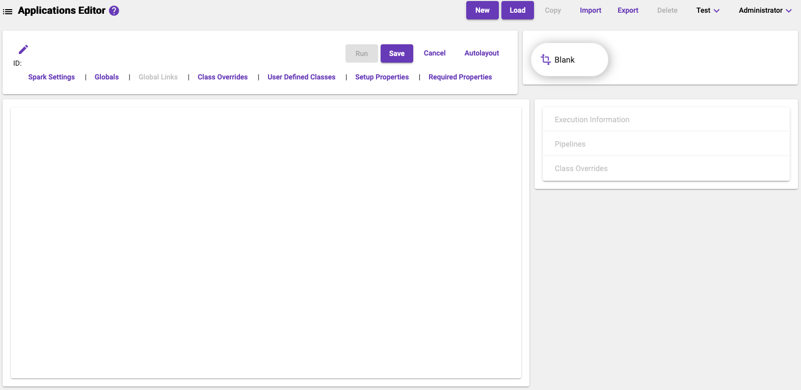

[Home](readme.md)

# Application Editor
The _Application Editor_ screen provides tools for building and maintaining [Metalus applications](https://acxiom.github.io/metalus/docs/applications.html). The screen consists of several
sections that each serve a specific purpose.

* [Context Actions](application-editor-context-actions.md)
* [Control Panel](application-editor-control-panel.md)
* [Execution Templates](application-editor-execution-templates.md)
* [Designer](application-editor-designer.md)
* [Execution Parameters](execution-parameters.md)

