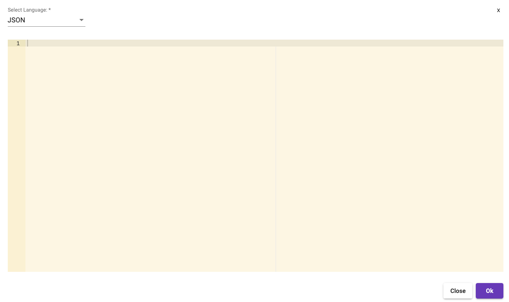

[Home](readme.md)

# Code Editor
Metalus Studio provides an integrated code editor based on the [ACE Code](https://ace.c9.io/) editor. Syntax will
be selected based on the information available. The editor appears as a modal or embedded throughout the UI.

Syntax highlighting is available for JSON, Javascript, Scala and SQL and can be changed using the syntax drop down. The 
syntax drop down will be hidden when a component uses the code editor embedded.
