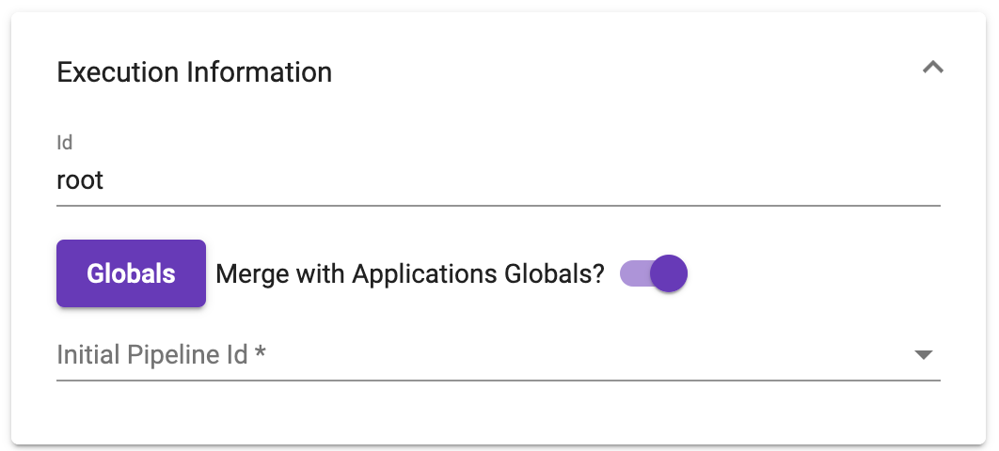
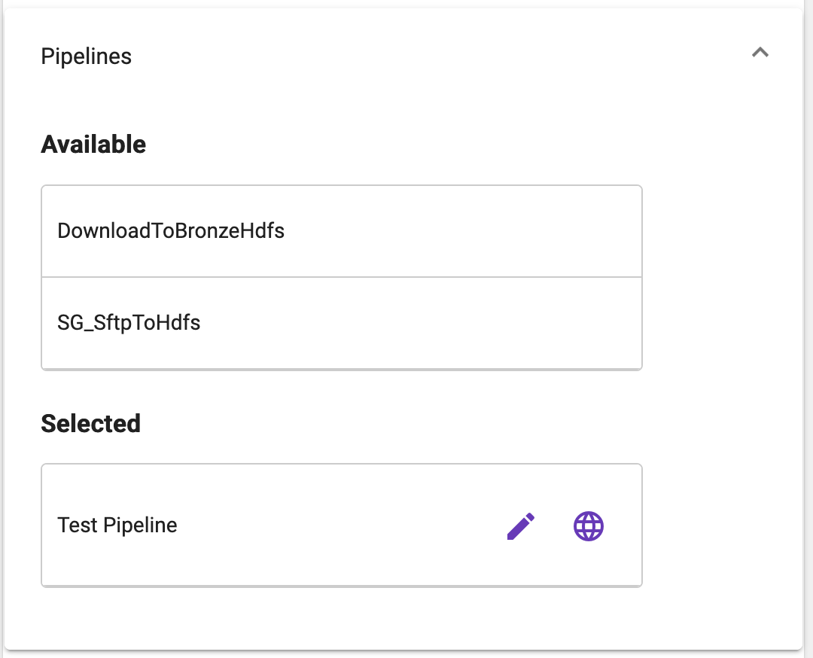
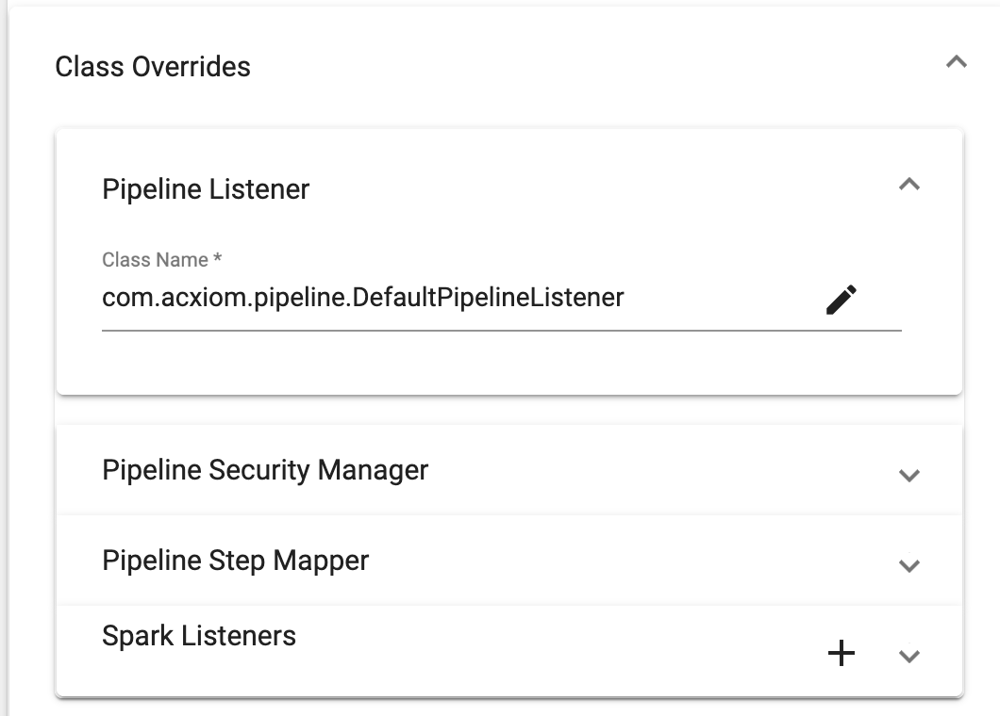

[Home](readme.md)

# Execution Parameters
The execution parameters panel provides a means to configure the selected execution.
## Execution Information
The execution information panel has three parameters that can be changed:
### Id
The execution id is a unique id within the application.This id is used to establish dependencies, display 
on the designer and as a reference for Global Links.
### Globals
The globals button will open the [object editor](object-editor.md) allowing execution specific globals. These globals will 
override the application level globals unless the _Merge with Application Globals_ toggle is selected.
### Initial Pipeline Id
This optional dropdown can be used to set the _initialPipelineId_ which will select the pipeline that should 
be executed. This option should not be used in a normal application.

## Pipelines
The pipelines panel allows selecting pipelines from the known pipelines to execute. Drag a pipeline from the 
available list to the selected list to add the pipeline to the execution. Once in the list, the order may be 
set by dragging the pipelines into the correct order. Once a pipeline has been added to the selected list, two 
icons will be present to allow editing the _Pipeline Parameters_. The pencil icon is used for the parameters 
specific to the execution while the globe icon is used for the global parameters. Execution level parameters
will override the global parameters. There is no option to merge.

## Class Overrides
The class overrides panel allows custom _Pipeline Listener_, _Pipeline Step Mapper_, _Pipeline Security Manager_ 
and _Spark Listeners_ to be registered for use with this execution. These will override the global class overrides.
The pencil icon will open the [object editor](object-editor.md) to map parameters.

