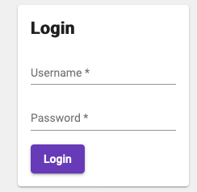
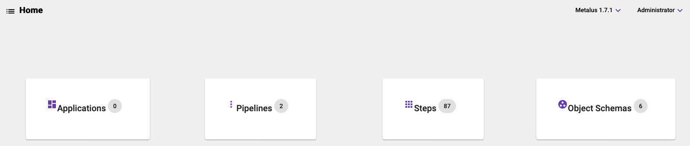

# Getting Started
## Mongo Setup
Mongo is the recommended backend for production usage. The default database name is _metalus_.
An administration user will need to be created before the UI can be used. 

There are two setup methods the user listed below (both methods create a username of _admin_ 
with a password of _admin_):
 
### Import
Importing the users.json file located under the *common_steps_preloaded_data/mongo* 
directory in the GitHub project:

```shell script
mongoimport --db=metalus --collection=users --file=users.json
```

### Manual
The _users_ collection can also be setup manually. Start by creating the _users_ collection. 
Next create the admin record:

```javascript
db.users.insertOne({
    id: '1',
    displayName: 'Administrator',
    username: 'admin',
    password: '$2b$08$nAabZ9FOg/me5U/a3vmCie0YnkzmvezqUfetzrQlmMEosQYfvI3TK',
    role: 'role',
    defaultProjectId: '1',
    projects: [
        {
            id: '1',
            displayName: 'Default Project'
        }
    ]
});
```
## Docker Setup
Docker images for the [release](https://hub.docker.com/r/dafreels/metalus-studio/tags?page=1&name=latest) and [development](https://hub.docker.com/r/dafreels/metalus-studio/tags?page=1&name=dev) versions of Metalus Studio
are available from the [Docker Hub](https://hub.docker.com/r/dafreels/metalus-studio).
### Running Local Dev Mongo
Several environment variables are available to allow configuring the service:

|Environment Variable|Default Value    |
|--------------------|-----------------|
|storageType         |mongodb          |
|databaseServer      |localhost        |
|databaseName        |metalus          |
|databaseSSL         |false            |
|databaseUser        |not set          |
|databasePassword    |not set          |
|baseJarsDir         |/opt/metalus/jars|

#### Download Docker Image
```shell script
docker pull dafreels/metalus-studio:dev
```
#### Start Docker Container
This command will start Metalus Studio at URL [http://localhost:8000/](http://localhost:8000/):
```shell script
docker run --rm -p 127.0.0.1:8000:8000 -e "NODE_ENV=mongo" -e "databaseServer=host.docker.internal" --name metalus dafreels/metalus-studio:dev
```
#### Stop Docker Container
```shell script
docker stop metalus
```
## Login
The login screen takes a login and password:


## Landing Screen
The landing screen provides some simple counts about the metadata stored by the backend by [project](projects.md).

* Applications
* Pipelines
* Steps
* Object Schemas



Upon login or after each [metadata upload](upload.md), users will be brought back to this screen.

## [Upload Metadata](upload.md)
The final step to prepare Metalus Studio for use is to upload metadata. Navigate to the [upload screen](upload.md) by
clicking the _navigation_ menu.


Proceed to the [Upload Metadata](upload.md) documentation for more information.

## Editors
Once metadata is available, you may proceed to the [Pipelines-Editor](pipeline-editor.md) to being working with pipelines.
