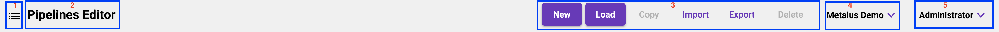
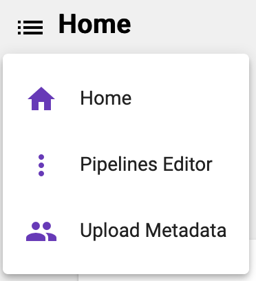
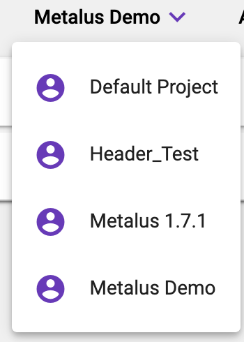
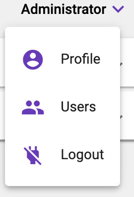

[Home](readme.md)

# Navigation Bar
The navigations bar will always appear at the top of the screen and contains several key components.

1) Navigation Menu
2) Screen Header
3) Context Buttons
4) Project Menu
5) User Menu

## Navigation Menu
The navigation menu provides links to the different screens used for managing metadata.

## Screen Header
The screen header displays the name of the current screen.
## Context Buttons
Each screen will define a different set of optional buttons that will be available. 
## Project Menu
The project menu shows the current selected project. All metadata will be sourced from this project. This 
menu also acts as a shortcut for changing the default project.

## User Menu
The user menu provides navigation links to the different user related screens. The _Users_ navigation item will only
appear for users with the _administrator_ role.

