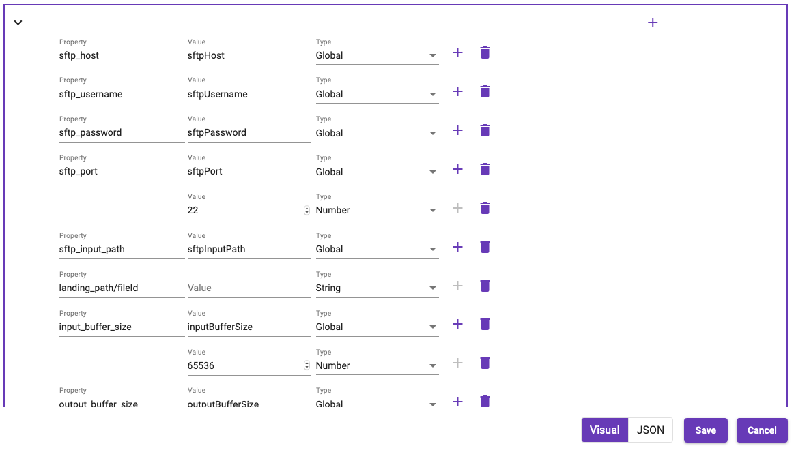
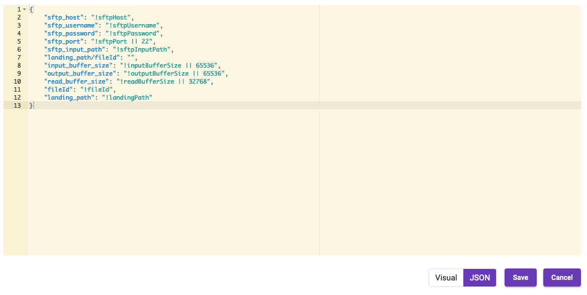

[Home](readme.md)

# Object/List Editor
The object editor allows pipeline designers to build objects and lists that can be passed to step parameters. Complex
objects and list can be constructed using the editor. Two views are available:

##Tree view

The editor makes building objects and lists easier by providing similar controls implemented by 
[step parameters](step-parameters.md). The tree view is ideal for building parameters with embedded
objects and lists that contain objects. The objects and list can also used mapped values including
alternate value mappings.

Each level will have a button that allows adding new parameters. Once a parameter has been added, normal
mapping rules apply. List values will not have property names, but will display the index id within the list.

Step Group Pipeline Mappings also use this editor. The sub-pipeline will be scanned for all global mappings
and presented as parameters. This is the only instance where parameters will be preloaded without an existing 
object/list.

## Code View
The code view is for power users that understand Metalus mappings enough to manipulate the JSON directly.

