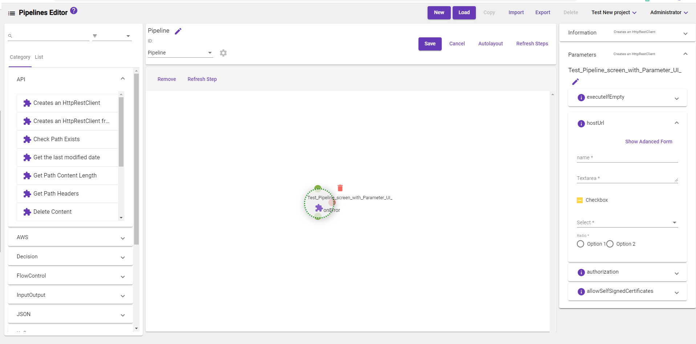

[Home](readme.md)
# Parameter Editor 
The Parameter Editor is a specialized component which gives admins the ability to configure formly JSON 
structure to render a custom UI for a step parameter. This allows step library creators the ability to
build custom parameter forms without the user needing to understand how Metalus mapping works. When
working in the code editor, the JSON provided will be applied to the _fields_ property of the form. No
other properties are exposed. Documentation for formly is provided [here](https://formly.dev/guide/expression-properties).
[Examples](https://formly.dev/ui/material) for material may be used to help understand the syntax.

Steps to follow in parameter editor
1. Go to Navigation Menu panel oon the navigation bar and select Parameter Editor. 
2. Select any step from left side list. 
3. Select the parameter on the right side.
4. Enter a JSON form definition.

 

5. Click the preview button to see the results.

6. Click the _Show Advanced Form_ to revert to the provided UI.

## Pipeline Editor
After the form has been saved for the step, the new form will begin displaying in the [Pipeline Editor](pipeline-editor.md).

.
