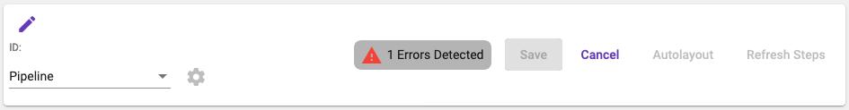

# Control Panel
The control panel provides access to the specific properties of the pipeline including the name and type. The gear
icon next to the type drop down will be enabled if the pipeline is a _step-group_. Clicking the icon will display the 
[step group result modal](pipeline-editor-designer.md#map-step-group-result).

Real time errors will be displayed here. Clicking the error display will open a modal providing specific issues. 

Action buttons for working with the pipeline include:

* Save: Saves the pipeline
* Cancel: Cancels any unsaved changes
* Auto Layout: Organizes the steps on the designer
* Refresh Steps: Refreshes the pipeline step metadata with the step template data. Since the step data stored on the
pipeline is independent of the original step template, this allows any changes to be synchronized.

