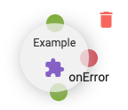

[Home](readme.md)

# Designer
The designer allows organizing and linking pipeline steps.

## Step
When a step is dragged to the designer, it will have a single input (top), delete icon, _onError_ and output (bottom, side). 
A user can link the output of a step to the input of another step to indicate execution order. The _onError_ port is 
optional, but is useful for handling step errors.

## Actions
Each step type has a list of actions available in addition to the remove action. To access, click on the step and a toolbar will
appear at the top of the designer.

### Refresh Step
Similar to the _Refresh Steps_ button on the control panel, this action will refresh the step metadata for this step.
### Step Group Actions
Two additional actions are available to step groups:
#### Map Step Group Result
This will open the Step Group Result modal. The modal provides a single parameter control from the 
[Step Parameters](step-parameters.md) component except the script and object types.

#### Show Pipeline
When a pipeline has been selected, this will open a designer modal with a read only view of the _step-group_ pipeline.

