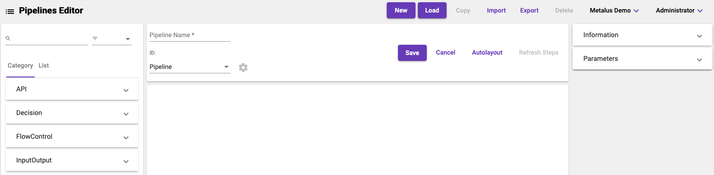

# Pipeline Editor
The _Pipeline Editor_ screen provides tools for building and maintaining Metalus pipelines. The screen consists of several
sections that each serve a specific purpose.

* [Context Actions](#context-actions)
* [Step Selector](#step-selector)
* [Control Panel](#control-panel)
* [Designer](#designer)
* [Step Parameters](#step-parameters)

## Context Actions
Context buttons a displayed for taking actions against pipelines.
### New
This will create a new pipeline.
### Load
This will show the list of existing pipelines and allow the user to select one for editing.
### Copy
This will copy the selected pipeline in the editor and load it. The user will be required to save
the pipeline to generate a new id and store the changes.
### Import
This will open the [code editor](code_editor.md) with the syntax set to JSON. The user can
paste a JSON pipeline and load it to the editor. The user will be required to save the pipeline 
to store the changes.
### Export
This will open the [code editor](code_editor.md) with the syntax set to JSON. The selected pipeline
will be loaded.
### Delete
This will delete the selected pipeline.
## Step Selector
The _step selector_ provides easy access to all steps available to be chosen. Steps will be dragged from
the _step selector_ to the [designer](#designer). Other than the preloaded steps, all other steps will be
provided from the step library.
### Filter
A filter text box allows the user to type in a name/command to reduce the list of steps. The drop down 
allows filtering steps by tags.

  
### Flow Control Steps
A set of steps that provide flow control have been provided under the _Flow Control_ expansion panel.

#### Fork/Join
The fork/join steps provide support for the fork/join logic.
#### Step Group
The _Step Group_ step provides a blank step for defining a step group. This step should be used only if the 
[Step Groups panel](#step-groups) doesn't have a specific step. Using this step may prevent viewing the
step group pipeline.
#### Custom Branch
The custom branch step allows creating a dynamic branch step without having to provide the step as code. A modal
will be displayed for this step that allows picking a base step and providing a name, display name and description.
The user will also be required to define at least one result before the step can be saved.

### Step Groups
When the Pipeline Editor loads, the pipeline metadata will be scanned for _step-group_ pipelines. An entry
in the _Step Groups_ will be created that can be dragged to the designer. The pipeline will be preloaded
allowing the _pipelineMappings_ to be mapped. Premapped step groups should be used instead of the blank
_Step Group_ found with the [Flow Control Steps](#flow-control-steps).

## Control Panel
The control panel provides access to the specific properties of the pipeline including the name and type. The gear
icon next to the type drop down will be enabled if the pipeline is a _step-group_. Clicking the icon will display the 

Real time errors will be displayed here. Clicking the error display will open a modal providing specific issues. 

Action buttons for working with the pipeline include:

* Save: Saves the pipeline
* Cancel: Cancels any unsaved changes
* Auto Layout: Organizes the steps on the designer
* Refresh Steps: Refreshes the pipeline step metadata with the step template data. Since the step data stored on the
pipeline is independent of the original step template, this allows any changes to be synchronized.

## Designer
The designer allows organizing and linking pipeline steps.

### Step
When a step is dragged to the designer, it will have a single input (top), delete icon, _onError_ and output (bottom, side). 
A user can link the output of a step to the input of another step to indicate execution order. The _onError_ port is 
optional, but is useful for handling step errors.

### Actions
Each step type has a list of actions available in addition to the remove action. To access, hold the _shift_ key while
clicking on the step.

#### Refresh Step
Similar to the _Refresh Steps_ button on the control panel, this action will refresh the step metadata for this step.
#### Step Group Actions
Two additional actions are available to step groups:
##### Map Step Group Result
This will open the Step Group Result modal. The modal implements that same control as the [Step Parameters](#step-parameters)
component.

##### Show Pipeline
When a pipeline has been selected, this will open a designer modal with a read only view of the _step-group_ pipeline.

## Step Parameters
Selecting a step in the designer will populate the _Step Parameters_ component. There are two parts to the
step parameters:
### Information
This is a read only view of the step metadata that will be used by the pipeline step during execution.

#### Id
This is the id assigned to the step by the annotation.
#### Name
The name of the step. This is displayed in the [Step Selector](#step-selector).
#### Tags
List of tags available for filtering. The name of the jar will be added automatically by the 
[Upload Metadata](upload.md) screen.
#### Category
The category specified for this step. It is used to group steps into expansion panels.
#### Engine Meta Command
This is the scala object and function tha defines the step.
#### Engine Meta Package
This is the scala package where the step object lives.
#### Description
The description provided by the step. This will be used in tooltips.
### Parameters
