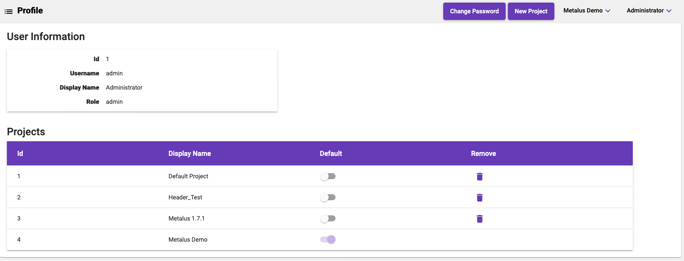

# Profile
The profile screen allows a user to manage different aspects of the account.

## Change Password
The _Change Password_ context button will allow the user to change the password.
## New Project
The _New Project_ context button allows for the creation of a new blank project.
## Projects
The projects table displays each project with the _Display Name_ used in the [project menu](navigation-bar.md#project-menu)
and the id of the project. The _Default Project_ toggle button allows changing the default. The remove button
allows the project and all associated metadata to be deleted. The current default project cannot be deleted.
