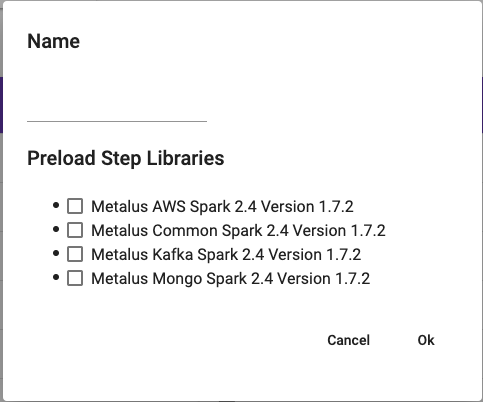

[Home](readme.md)

# Projects
Projects are a mechanism used to segregate metadata. A user may have one or more projects at any given time. An example
would be a user that is building pipelines for internal Spark applications, AWS Spark applications and GCP Spark
applications.

## New Project
The initial project provided to a user will not have nay metadata loaded, but the user has the option of creating
a new project and selecting to load existing Metalus metadata.

