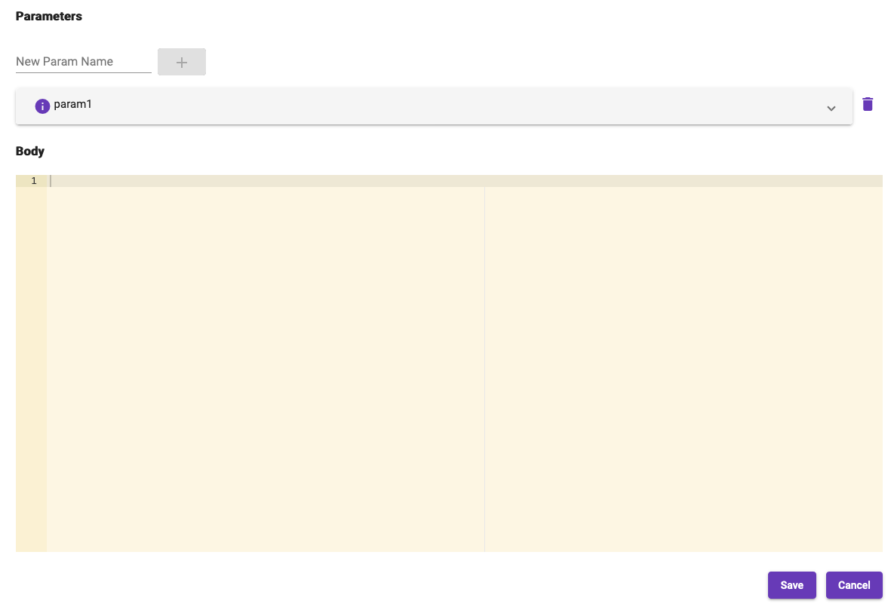
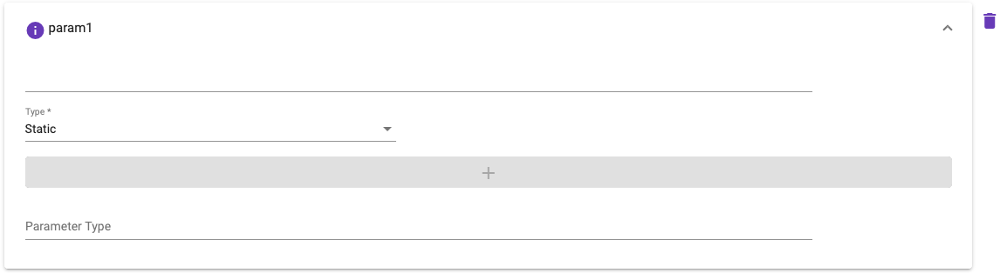

[Home](readme.md)

# Scalascript Editor
The _scalascript_ editor is a specialized component which gives pipeline designers the ability to embed scala
script code within a mapping. Prior to this feature, a developer would either need to create a custom step
or write a scala step with custom logic when the values available didn't meet the requirements of step
parameter. One use case when a _scalascript_ mapping could be used is to filter a list before passing it
to the step function.

Parameters can be added by providing a name and clicking the add button. This will create an expansion panel
that functions just like [step parameters](step-parameters.md).

Each parameter name can be access in the script body. The value will be passed after any mapping logic has been 
executed. An optional parameter type field allows for a fully qualified classname to be provided. The value will 
be cast automatically if provided prior to passing to the script body.
