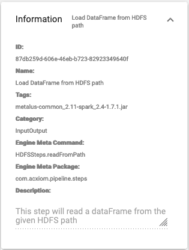
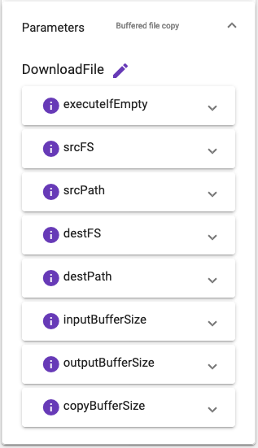
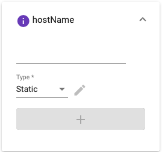
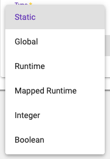
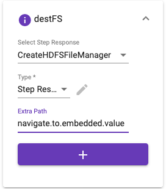

# Step Parameters
Selecting a step in the designer will populate the _Step Parameters_ component. There are two parts to the
step parameters:
## Information
This is a read only view of the step metadata that will be used by the pipeline step during execution.

### Id
This is the id assigned to the step by the annotation.
### Name
The name of the step. This is displayed in the [Step Selector](step-selector.md).
### Tags
List of tags available for filtering. The name of the jar will be added automatically by the 
[Upload Metadata](upload.md) screen.
### Category
The category specified for this step. It is used to group steps into expansion panels.
### Engine Meta Command
This is the scala object and function tha defines the step.
### Engine Meta Package
This is the scala package where the step object lives.
### Description
The description provided by the step. This will be used in tooltips.
## Parameters
The parameters panel enables configuring the pipeline step. The user can change the pipeline step id that 
was defined. The _executeIfEmpty_ parameter will appear for every step allowing the user to provide a 
mapping that will define if this pipeline step will execute. All other parameters will be dynamically 
generated based on the step template.

### Dynamic Parameter
Dynamic parameters have a basic form that is used to populate the settings. The basic components of the parameter
is the value, type, edit button, and the add button. The information icon to the left of the parameter name
will show a description of the parameter if it is available.

The value is what will be used to pass data to the step function parameter. The value mau be a mapping
(global, runtime, mapped runtime, step response or secondary step response) or the actual value. The 
parameter type determines which fields are available and how the value will be rendered.

|Value Display|Types                                  |Edit Button Enabled|
|-------------|---------------------------------------|-------------------|
|Text Field   |Static, Global, Runtime, Mapped Runtime|N                  |
|Drop Down    |Step Response, Secondary Step Response |N                  |
|Drop Down    |Pipeline                               |N                  |
|Toggle       |Boolean                                |N                  |
|Number Field |Integer                                |N                  |
|Label        |List, Object, Script, Scalascript      |Y                  |

The UI supports Metalus alternate value mapping for each parameter. The large plus button will be enabled
if the selected type supports alternate mappings. Alternate value mappings provide the pipeline designer
a mechanism for allowing data to be pulled from alternate locations. As an example, if the first mapping 
is a missing global, Metalus will then look to see if an alternate mapping has been provided. This process
will continue as long as there are alternate mappings available, or it finds a valid value.

|Type                   |Button Enabled|
|-----------------------|--------------|
|Static                 |N             |
|Step Response          |Y             |
|Secondary Step Response|Y             |
|Global                 |Y             |
|Runtime                |Y             |
|Mapped Runtime         |Y             |
|Integer                |N             |
|Boolean                |N             |
|Object                 |N             |
|List                   |N             |
|Script                 |N             |
|ScalaScript            |N             |

The step response and secondary step response types will present a drop down which lists all pipeline steps
that proceed the selected step in the execution chain. When selected, an additional text field will be
presented that allows an extra path to be entered which will be used to access embedded values.

There is also a special type named _Pipeline_ which will be available when the selected step is a step-group, and
the parameter name is _pipeline_. The value will be a drop down listing all _step-group_ pipelines that are available.

The List, Object, Script and Scalascript types enable the edit button which will open the specific editor. The list
and object types will open the [object editor modal](object-editor.md), while the script type will open the 
[code editor](code-editor.md) with the syntax preselected based on the _language_ attribute of the step metadata. The
scalascript type will open the [scalascript editor modal](scala-script-editor.md).
