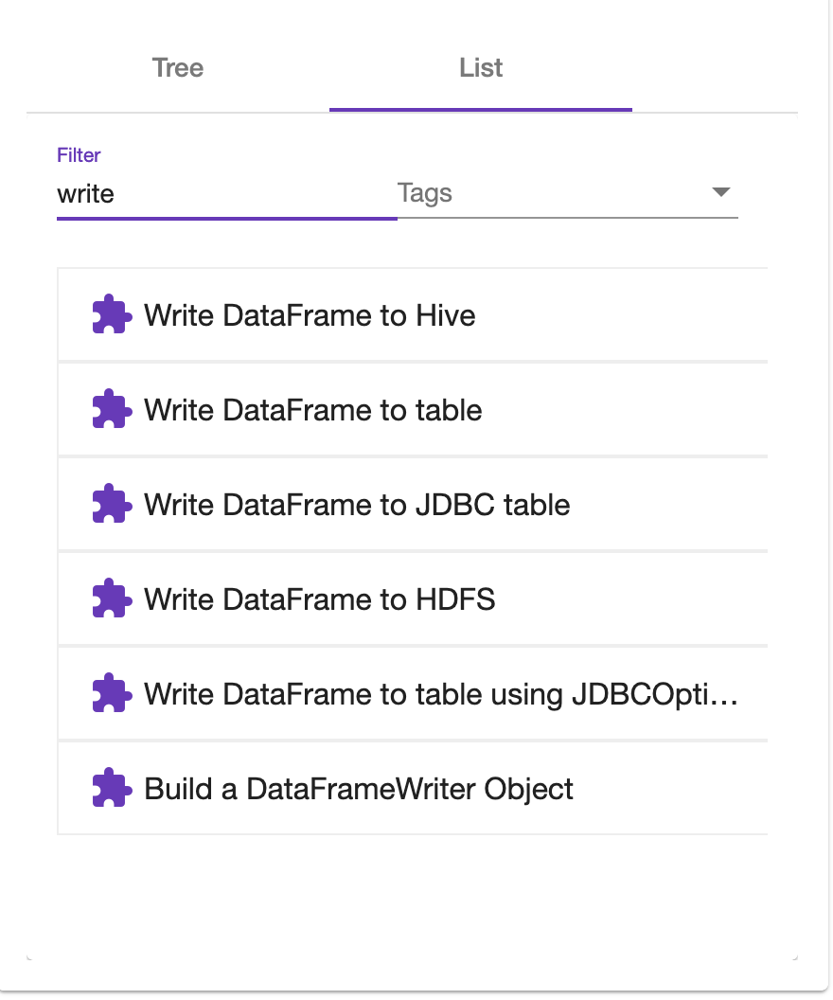
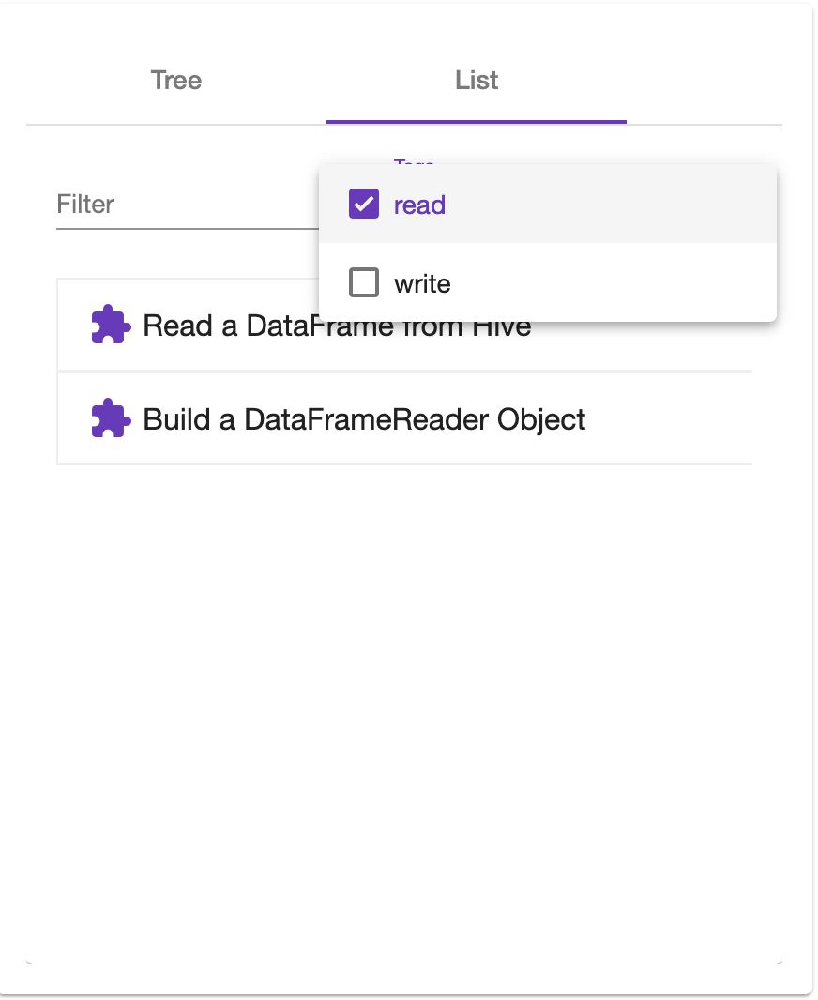
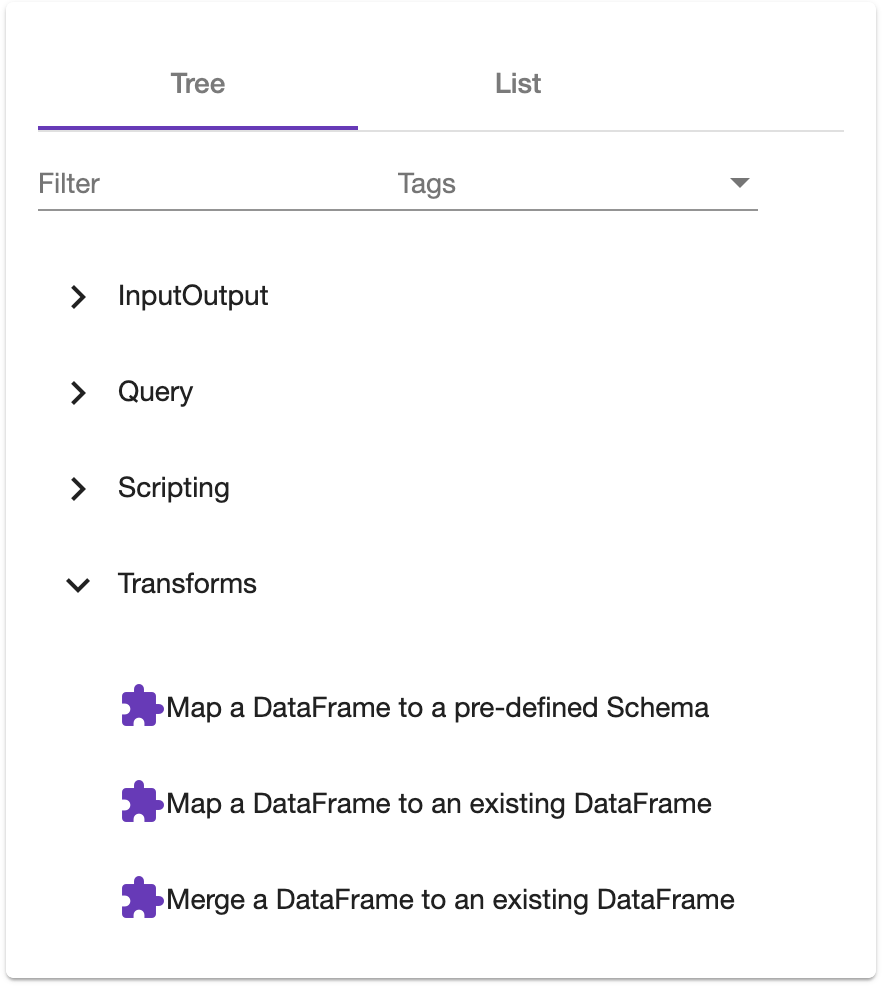
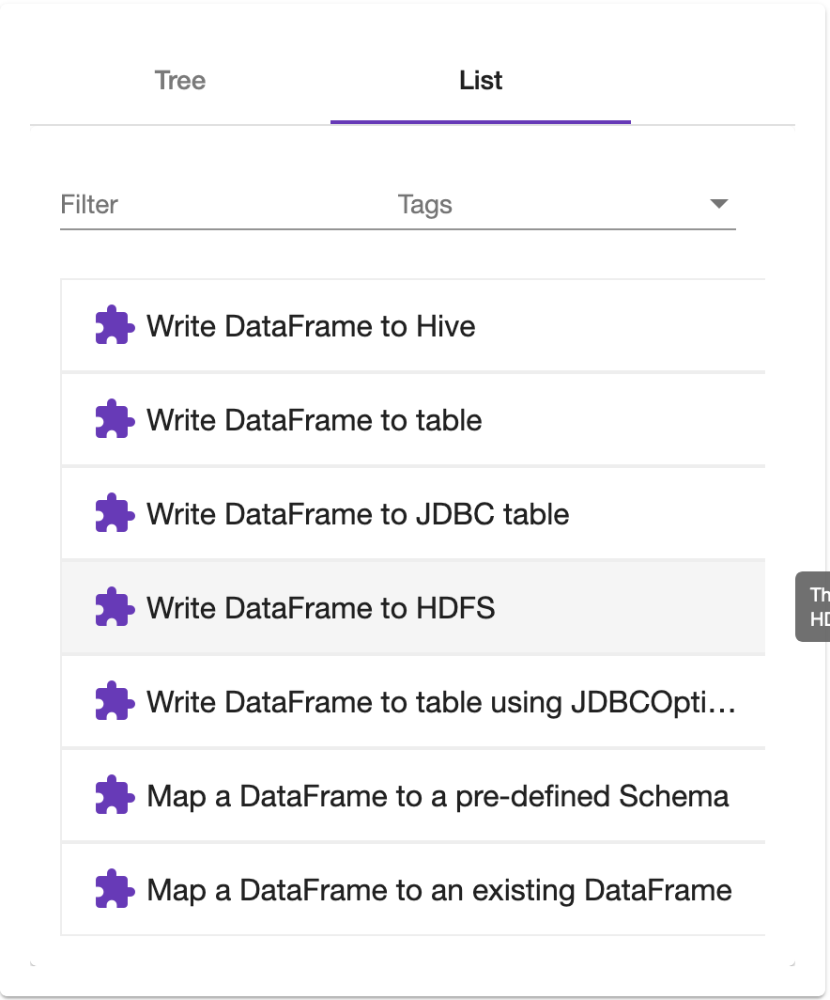

# Step Selector
The step selector provides a mechanism for navigating the steps library. Different views and filters are provided
which help with navigation. The Steps and Pipelines Editors use the selector to provide a common navigation control. 

## Filter
The filter text box will filter the steps, by name in a case insensitive manner. The filter value is not linked between the list and tree views.

## Tags
The tags drop down allows selecting one or more tags. Any step that matches any selected tag will be shown. The drop down is populated using
the tags field from the steps loaded from the API.

## Tree
The tree view provides a traditional tree view for navigating the steps. The tree is grouped using the category field.

## List
The list provides a simple flat list of steps with no grouping.

