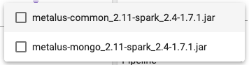
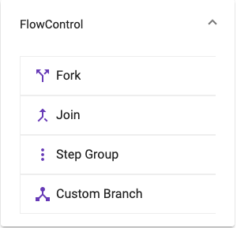
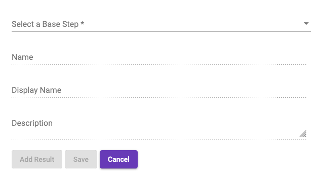

# Step Selector
The _step selector_ provides easy access to all steps available to be chosen. Steps will be dragged from
the _step selector_ to the [designer](#designer). Other than the preloaded steps, all other steps will be
provided from the step library.
## Filter
A filter text box allows the user to type in a name/command to reduce the list of steps. The drop down 
allows filtering steps by tags.

  
## Flow Control Steps
A set of steps that provide flow control have been provided under the _Flow Control_ expansion panel.

### Fork/Join
The fork/join steps provide support for the fork/join logic.
### Step Group
The _Step Group_ step provides a blank step for defining a step group. This step should be used only if the 
[Step Groups panel](#step-groups) doesn't have a specific step. Using this step may prevent viewing the
step group pipeline.
### Custom Branch
The custom branch step allows creating a dynamic branch step without having to provide the step as code. A modal
will be displayed for this step that allows picking a base step and providing a name, display name and description.
The user will also be required to define at least one result before the step can be saved.

## Step Groups
When the Pipeline Editor loads, the pipeline metadata will be scanned for _step-group_ pipelines. An entry
in the _Step Groups_ will be created that can be dragged to the designer. The pipeline will be preloaded
allowing the _pipelineMappings_ to be mapped. Premapped step groups should be used instead of the blank
_Step Group_ found with the [Flow Control Steps](#flow-control-steps).

