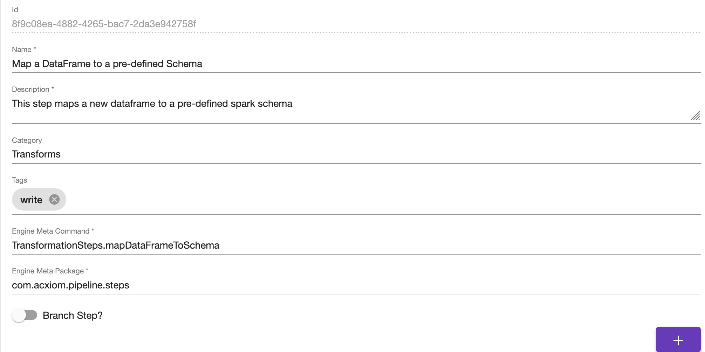
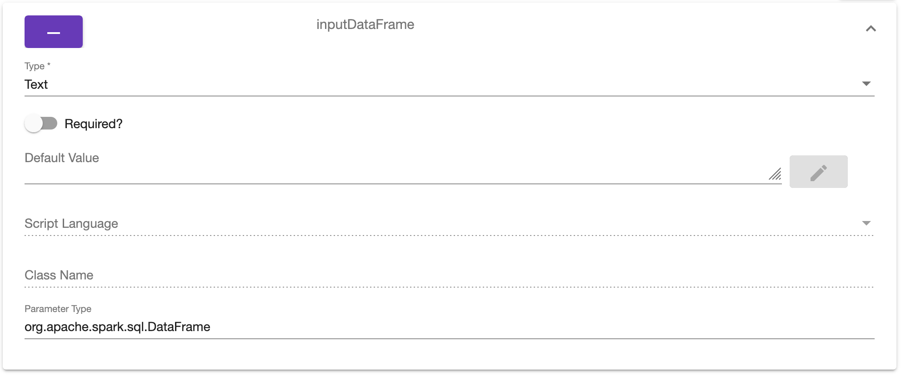

# Steps Editor
The Steps Editor is used to load and manage the step metadata that the [Pipelines Editor](pipelines-editor.md) uses to populate the parameters
forms and the designer. The [Step Selector](step-selector.md) navigation control is used to select the step to edit.

# Actions
Several actions can be taken on the Steps Editor.

## Bulk
The bulk button opens the *Code Editor* and allows pasting the JSON output from the [Step Metadata Extractor](https://github.com/Acxiom/spark-pipeline-driver/tree/develop/application-utils). This
includes steps metadata and package objects metadata. Alternatively, the user can simply paste in the steps array from the output JSON. The APIs
will attempt to perform an upsert which may result in any changes being overwritten.

## Delete
The delete button will delete the step metadata from the system. This will **not** remove the metadata from any pipeline or application that has a reference.

## New
The new button will create an empty step. This will cause the form to clear and prompt the user to save if any changes are pending.

## Cancel
The cancel button will reset any pending changes.

## Save
The save button will perform any validations and then save the latest changes.

# Form
The form contains several common fields that every step will have:

## Id
This is the unique id for this step. It cannot be changed in the UI.
## Name
This is the name that is displayed in the [Step Selector](step-selector.md) navigation control and logged by the Spark Pipeline Driver at runtime.
## Description
This is a more detailed description of the step. This should include any extra information a user may need when trying to determine
the function of this step. The description is used as a tool tip on the [Pipelines Editor](pipelines-editor.md) to help provide context.
## Category
This defines the base category for the step. The tree view of the [Step Selector](step-selector.md) uses this to group steps.
## Tags
This is a list of tags to provide additional context and filtering for the step.
## Branch type
Determines if this is a branch step or a normal step.
## Engine Meta Command
This is the actual step function that will be called by the Spark Pipeline Driver.
## Engine Meta Package 
This is the package for the executable code.
## Add Parameter
The Add Parameter button allows the user to add a new parameter form.
## Parameters
The list of parameters will be customized for each step, but each parameter will have a set of standard fields. Each parameter will be
a collapsible form where the header contains remove button and the parameter name.

### Type
This is the type that the value of the step should be. Supported types include:
* **string**: String data is expected here 
* **integer**: A number is expected here
* **list**: A list will be provided
* **boolean**: Either true or false
* **script**: This indicates the value should be parsed as a script. The **Script Language** field must be set.
* **text**: This indicates that string data should be parsed to see if variable expansion is used.
* **result**: Indicates this parameter will contain the next step id. The step type must be branch.
* **object**: Indicates the value of this step will be an object. The Object Editor is provided to edit the value.
### Required
Boolean flag indicating whether the user must set the value for this step once it has been added to a pipeline.
### Default Value
This field can be used to provide a value in case the user doesn't set one when building out the pipeline.
### Script Language
When the type is set to script, then this should indicate the language to be used.
### Class Name
When the type is set to object, then this should indicate which class should be instantiated and populated with the data.
### Parameter Type
This indicates the actual parameter type in the code. In a future release, this will be used to help validate mappings in the
[Pipelines Editor](pipelines-editor.md).
