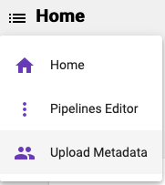
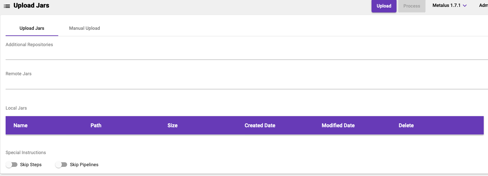
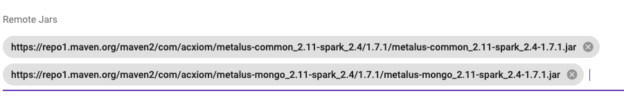
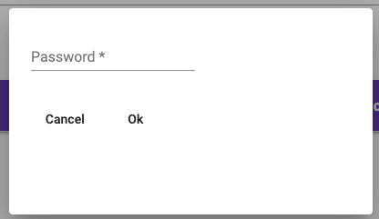
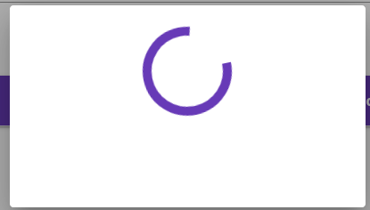
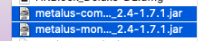
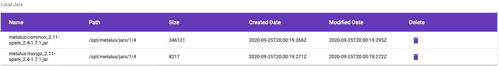

[Home](readme.md)

# Upload Metadata
Before working with pipelines or applications, metadata must be uploaded for the 
step libraries that will be used in the final application. After the initial upload, 
additional step libraries can be uploaded as well as the same step libraries in case 
the step library changed.

The Upload Screen can be accessed by clicking the left navigation menu and selecting the _Upload Metadata_ option:

This will load the _Upload Screen_:

### [Projects](projects.md)
The _Upload Metadata_ screen works with the default project. Be sure you have selected the
correct project before beginning to upload. Once metadata has been uploaded, it cannot be 
reverted.

## Upload Jars
The _Upload Jars_ tab provides an automated way to load metadata from step libraries into Metalus Studio.
### Additional Repos
This is a list of alternate locations to look when resolving dependencies. These should be Maven repos.
### Remote Jars Text Field
Metalus Studio can download jars from any accessible endpoint including Maven Central. After adding the full
path to each jar, the Metadata Extractor will download the jars, determine the dependencies and then
upload the metadata.
### Local Jars Table
This table shows information about any jars that have been uploaded and are waiting to be processed.
### Skip Steps
This switch tells the metadata extractor to not upload step metadata from the step libraries.
### Skip Pipelines
This switch tells the metadata extractor to not upload pipeline metadata from the step libraries.
## Manual Upload
The manual upload tab provides a template for running the Metalus Metadata Extractor locally 
and using the API to upload metadata. There will be no further interaction with this screen.
## Upload Metalus Step Libraries
The Metalus Step Libraries are available in the Maven Central repository and provide a good start
for any project. This example will use the Metalus Common and Metalus Mongo step libraries to demonstrate
how to load metadata into Metalus Studio.

* Metalus Common - https://repo1.maven.org/maven2/com/acxiom/metalus-common_2.11-spark_2.4/1.7.1/metalus-common_2.11-spark_2.4-1.7.1.jar
* Metalus Mongo - https://repo1.maven.org/maven2/com/acxiom/metalus-mongo_2.11-spark_2.4/1.7.1/metalus-mongo_2.11-spark_2.4-1.7.1.jar

### Remote Jars
Since the jars are available from Maven Central, it is easy for Metalus Studio to download and process the jars.
Enter the URL to each jar in the provided text field:

Click the _Process_ button:

You will be prompted for a password:

Wait for processing to complete:

Once complete, you will be taken to the [Landing](getting-started.md#landing-screen) screen and shown 
the counts of the uploaded metadata.
### Local Jars
Metalus Library provides several step libraries that are useful when getting started, however developers
will eventually need to provide custom step libraries. These step libraries may exist on the developers
local computer and not be available in a Maven Repository. Metalus Studio allows users to upload the jars 
directly to the server for processing. Start by downloading the two jars we need to a local directory. Once 
the jars have been downloaded, click the upload button:

 

Select one or more jars and click open:

The local jars table should now show the uploaded jars:

Click the _Process_ button:

You will be prompted for a password:

Wait for processing to complete:

Once complete, you will be taken to the [Landing](getting-started.md#landing-screen) screen and shown 
the counts of the uploaded metadata.
