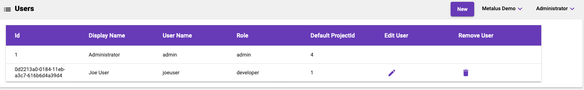
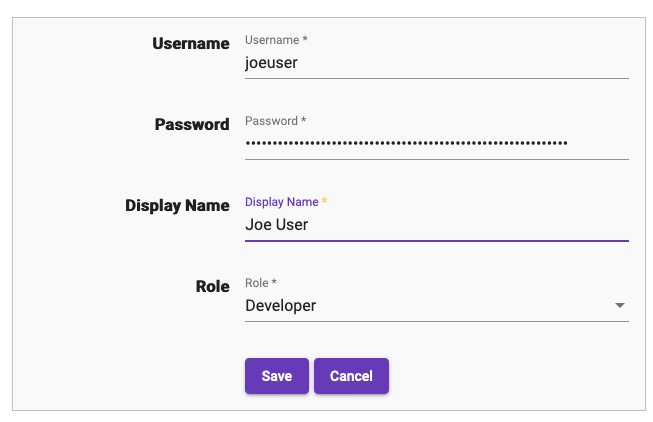

# Users
Metalus Studio and API requires a user account. Only users with the _admin_ role have access to the _Users_ screen.

## Id
The unique id assigned to this user. This is is used when interacting with the APIs.
## Display Name
The name that will be displayed in the [user menu](navigation-bar.md#user-menu).
## User Name
This is the value used to login to Metalus Studio or authenticate against the APIs.
## Role
### Developer
The developer role should be used by most users. User accounts with this role are able to access all screens except 
the _Users_ screen.
### Admin
The administrator role allows managing user accounts in addition to the functions allowed by the developer account.
## Default Project Id
The project id currently used for interacting with metadata.
## Edit User
This will allow updating the information for the user. The id is the only field not edittable.

## Remove User
This will remove the user from the system. All metadata will also be deleted.
